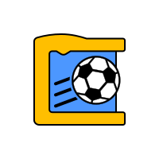

# SuperCodingBall

*Read in [English](README.md).*

SuperCodingBall est un jeu éducatif gratuit pour les enfants de 10 ans et plus.

Le but est de découvrir la programmation avec un jeu de foot ! (c'est un excellent moyen pour des enseignants de présenter des concepts de programmation)

La programmation est faite de façon visuelle, comme dans [Scratch](https://scratch.mit.edu/), mais avec moins de blocs (il n'y a par exemple pas de "boucles").

Le joueur va entraîner une équipe de 4 footballeurs qui vont affronter 4 monstres.

La stratégie de l'équipe est construite avec des blocs, ensuite le match se déroule automatiquement en suivant les stratégies des deux équipes.

# Mobile

On peut jouer à SuperCodingBall sur mobile, tablette ou ordinateur (dans ce cas, les blocs sont affichés à côté du terrain de foot).

Sur un appareil Android ou iOS, on peut installer l'application en tant que [PWA](https://web.dev/progressive-web-apps) (ça permet de pouvoir y jouer même sans connexion).

# Offline vs online

Il y a deux modes de jeu :
* le jeu local, contre l'ordinateur (avec quelques stratégies pré-définies)
* le jeu en ligne, contre d'autres joueurs (nécessite une connexion Internet)

Pour le jeu en ligne, SuperCodingBall utilise le service [Webcom](https://datasync.orange.com) pour stocker les informations des joueurs.
C'est un service réservé aux développeurs [Orange](https://www.orange.com), mais il peut être facilement remplacé par tout autre "Backend As a Service" (comme Firebase). 

Il y a 3 options pour se connecter :
* En tant qu'invité (ne permet pas d'utiliser plusieurs appareils)
* Avec un compte Facebook
* Avec un compte Google

Dans tous les cas, SuperCodingBall va stocker le pseudo (modifiable), les blocs et les résultats des matchs joués.

À tout moment, les joueurs peuvent supprimer leur compte.

## Blockly

SuperCodingBall utilise l'excellente bibliothèque [Blockly](https://developers.google.com/blockly) de Google pour gérer les interactions avec les blocs.

Pour générer les blocs personalisés, on peut utiliser les [Blockly Developer Tools](https://blockly-demo.appspot.com/static/demos/blockfactory/index.html), la source des blocs étant stockée [ici](./src/assets/blocks/library.xml).

Une fois le fichier [blocks.json](./src/assets/blocks/blocks.json) généré, il faut le modifier pour ajouter les styles, extensions et traductions.

## Création des sprites

Tous les sprites des joueurs viennent "l'Open Game Art Liberated Pixel Cup" et ont été générés par [cet outil](https://github.com/LiberatedPixelCup/Universal-LPC-Spritesheet-Character-Generator) :

* **Guy 1** (body=Body_color_amber head=Human_male_amber shoes=Basic_Shoes_brown legs=Pants_red hair=Messy1_blonde clothes=Sleeveless_2_navy sex=male)
* **Guy 2** (body=Body_color_black head=Human_male_black shoes=Basic_Shoes_charcoal legs=Pants_red hair=Cornrows_green eye_color=Eye_Color_brown clothes=Sleeveless_2_Buttoned_blue sex=male)
* **Girl 1** (body=Body_color_brown head=Human_female_brown shoes=Basic_Shoes_brown legs=Pants_red hair=Ponytail2_black eye_color=Eye_Color_brown clothes=Sleeveless_2_blue sash=Obi_blue sex=female)
* **Girl 2** (body=Body_color_light head=Human_female_light shoes=Basic_Shoes_brown legs=Pants_red hair=Long_tied_purple eye_color=Eye_Color_purple clothes=TShirt_Scoop_lavender sash=Obi_lavender sex=female)
* **Orc** (body=Body_color_green head=Orc_male_green legs=Long_Pants_black)
* **Lizard** (body=Body_color_bright_green head=Lizard_male_bright_green wings=Lizard_Wings_bright_green tail=Lizard_tail_bright_green legs=Long_Pants_black)
* **Wolf** (body=Body_color_pale_green head=Wolf_male_pale_green tail=Wolf_Tail_raven legs=Long_Pants_black)
* **Zombie** (body=Body_color_zombie_green head=Zombie_zombie_green overalls=Overalls_black)

## Traductions (pour le moment français, anglais, espagnol, russe, hébreu, allemand et arabe)

Toutes les traductions sont dans le [dossier i18n](./src/assets/i18n).

N'hésitez pas à contribuer si vous voulez ajouter une autre langue !

## Genèse
SuperCodingBall a été créé pour un concours interne, mais le site est gratuit, open source et sans publicité.
